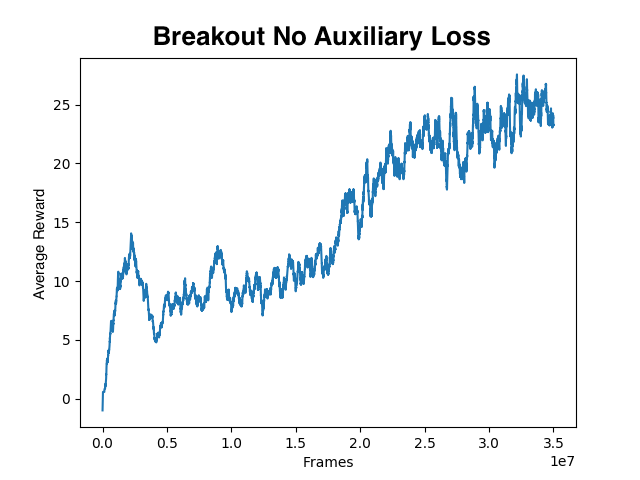
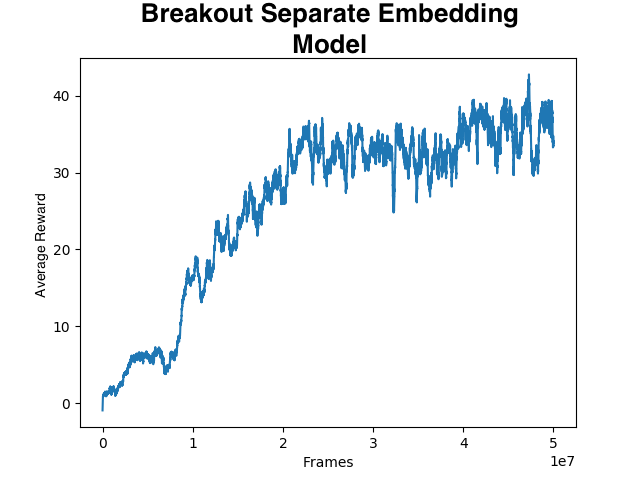

# Loose Recreation of _Curiosity Driven Exploration by Bootstrapping Features_
### July 7, 2018

## Description
This repo is a loose recreation of OpenAI's paper [Curiosity Driven Exploration by Bootstrapping Features](https://openreview.net/forum?id=H1RPJf5Tz). 

The algorithm trains a policy to play games purely off of reward generated from internal prediction error. The process can be visualized as a duel between a policy and a model that attempts to predict the future state of the environment (named the forward dynamics model). The policy is trained via [PPO](https://arxiv.org/abs/1707.06347) except that the environmental reward is replaced by the error of the forward dynamics model. More specifically, the reward used for PPO is the squared error of the forward dynamics model's predictions. The prediction targets of the forward dynamics model are a low dimensional representation of the next state in the environment. This is referred to as the intrinsic reward. The more inaccurate the forward dynamics model, the greater the reward for a given timestep. This encourages the policy to seek unseen states, and creates a robust predictive system.

## Implementation Notes
- This implementation does not include Hindsight Experience Replay
- This implementation normalizes the intrinsic rewards before using Generalized Advantage Estimation (GAE) in the PPO updates. This helps prevent divergence in the loss due to value prediction error. I do not believe the OpenAI version does this, but I could not get the algorithm to work without the intrinsic reward normalization.

## Performance
The algorithm was trained on OpenAI's gym Breakout-v0. The reward graphs are of the moving average reward collected at the end of each game episode using a moving average factor of 0.99.

------------------

This data was collected using the forward dynamics model without the inverse dynamics model (or any other auxiliary loss). 

------------------

This data was collected using the forward dynamics model without the inverse dynamics model (or any other auxiliary loss) using a seperate encoder for the forward dynamics and the policy. The encoder for the forward dynamics model was not trained after instantiation.

------------------

## Dependencies
- python 3.5 or later
- gym
- [gym-snake](https://github.com/grantsrb/Gym-Snake)
- numpy
- matplotlib
- pytorch 0.4.0

## How to Use this Repo
### Jumping In
You probably know how to clone a repo if you're getting into RL. But in case you don't, open a bash terminal and type the command:

    $ git clone https://github.com/grantsrb/CuriosityDriven-PPO

Then navigate to the top folder using

    $ cd CuriosityDriven-PPO

Hopefully you have already installed all the appropriate dependencies. See the section called **Dependencies** for a list of required dependencies.

To run a session on gym's Pong-v0 use the command:

    $ python main.py env_type=Breakout-v0

This will run a training session with the hyperparameters listed in the `hyperparams.py` file.

### Watching Your Trained Policy
After training your policy, you can watch the policy run in the environment using the `watch_model.py` script. To use this file, pass the name of the saved PyTorch state dict that you would like to watch. You can also specify the environment type and model type using `env_type=<name_of_gym_environment>` and `model_type=<model_type>` respectively.

Here's an example:

    $ python watch_model.py save_file=default_net.p env_type=Pong-v0 model_type=conv

### Automated Hyper Parameter Search
Much of deep learning consists of tuning hyperparameters. It can be extremely addicting to change the hyperparameters by hand and then stare at the average reward over time as the algorithm trains. THIS IS A HOMERIAN SIREN! It is too easy to change hyperparameters before their results are fully known, it is difficult to keep track of what you did, and the time spent toying with hyperparameters could be spent reading papers, studying something useful, or calling your Mom and telling her you love her (you should do that more often btw. And your dad, too.)

This repo contains an automated system under the name `hypersearch.py`. You can set the ranges of the hyperparameters you would like to search over manually, or use the untested and potentially buggy `make_hyper_range` function located in the `hyperparams.py` file. Then the `hyper_search` function also located in `hyperparams.py`. See `hypersearch.py` for an example.

### Command Line Arguments
RL algorithms often need to be tuned well for them to work. There are tons of hyperparameters that can have large impacts on the training of the algorithm. In order to help with automated hyperparameter tuning, this project offers a number of optional command line arguments. Each is set using `<argument_name>=<argument>` with no spaces. For example, if you wanted to set the variable `n_envs` (the number of parallel environments) to 15, then you would use the following:

    $ python train_model.py n_envs=12

#### List of Command Line Arguments
See `hyperparams.py` to access the default values.

##### String Hyperparameters
* `exp_name` - string of the name of the experiment. Determines the name that the PyTorch state dicts are saved to.
* `model_type` - Denotes the model architecture to be used in training. Options include 'fc', 'conv', 'a3c'
* `env_type` - string of the type of environment you would like to use PPO on. The environment must be an OpenAI gym environment.
* `optim_type` - Denotes the type of optimizer to be used in training. Options: rmsprop, adam
* `fwd_optim_type` - Denotes the type of optimizer to be used for the forward dynamics training. Options: rmsprop, adam
* `inv_optim_type` - Denotes the type of optimizer to be used for the inverse dynamics training. Options: rmsprop, adam

##### Integer Hyperparameters
* `n_epochs` - PPO update epoch count
* `batch_size` - PPO update batch size
* `cache_batch` - Batch size to use for updates from the cache on the fwd dynamics model.
* `max_tsteps` - Maximum number of time steps to collect over course of training
* `n_tsteps` - integer number of steps to perform in each environment per rollout.
* `n_envs` - integer number of parallel processes to instantiate and use for training.
* `n_frame_stack` - integer number denoting number of observations to stack to be used as the environment state.
* `n_rollouts` - integer number of rollouts to collect per gradient descent update. Whereas `n_envs` specifies the number of parallel processes, `n_rollouts` indicates how many rollouts should be performed in total amongst these processes. 
* `n_past_rews` - number of past epochs to keep statistics from. Only affects logging and statistics printing, no effect on actual training.
* `cache_size` - size of the memory replay buffer for the forward dynamics model.
* `n_cache_refresh` - number of training samples to be replaced in the buffer with each new data collection phase.

##### Float Hyperparameters
* `lr` - learning rate
* `lr_low` - if `decay_lr` is set to true, this value denotes the lower limit of the `lr` decay.
* `fwd_lr` - learning rate for the forward dynamics model
* `inv_lr` - learning rate for the inverse dynamics model
* `lambda_` - float value of the generalized advantage estimation moving average factor. Only applies if using GAE.
* `gamma` - float value of the discount factor used to discount the rewards and advantages.
* `gamma_high` - if `incr_gamma` is set to true, this value denotes the upper limit of the `gamma` increase.
* `val_coef` - float value determining weight of the value loss in the total loss calculation
* `entr_coef` - float value determining weight of the entropy in the total loss calculation
* `entr_coef_low` - if `decay_entr` is set to true, this value denotes the lower limit of the `entr_coef` coeficient decay.
* `max_norm` - denotes the maximum gradient norm for gradient norm clipping
* `epsilon` -  PPO update clipping constant
* `epsilon_low` - if `decay_eps` is set to true, this value denotes the lower limit of the `epsilon` decay.
* `fwd_coef` - float value between 0 and 1 determining the weight of the forward dynamics loss to the PPO loss.
* `inv_coef` - float value between 0 and 1 scaling the inverse dynamics loss within the loss term.
* `cache_coef` - float value determining the weight of the updates from the cache in the dynamics losses.

##### Boolean Hyperparameters
* `resume` - boolean denoting whether the training should be resumed from a previous point.
* `render` - boolean denoting whether the gym environment should be rendered
* `clip_vals` - if set to true, uses value clipping technique in ppo update
* `decay_eps` - if set to true, `epsilon` is linearly decreased from `epsilon`'s initial value to the lower limit set by `epsilon_low` over the course of the entire run.
* `decay_lr` - if set to true, `lr` is linearly decreased from `lr`'s initial value to the lower limit set by `lr_low` over the course of the entire run.
* `decay_entr` - if set to true, `entr_coef` is linearly decreased from `entr_coef`'s initial value to the lower limit set by `entr_coef_low` over the course of the entire run.
* `incr_gamma` - if set to true, `gamma` is linearly increased from `gamma`'s initial value to the upper limit set by `gamma_high` over the course of the entire run.
* `use_nstep_rets` - if set to true, uses [n-step returns](https://arxiv.org/abs/1705.07445) method for value loss as opposed to empirical discounted rewards.
* `norm_advs` - if set to true, normalizes advantages over entire dataset. Takes precedence over `norm_batch_advs`.
* `norm_batch_advs` - if set to true, normalizes advantages in each training batch. Will not be performed if `norm_advs` is set to true.
* `use_bnorm` - uses batch normalization in model if set to true
* `use_gae` - Uses Generalized Advantage Estimation with value predictions and bootstrapped rewards if set to true. Otherwise uses raw intrinsic rewards.
* `norm_rews` - Normalizes the rewards collected from the forward dynamics error if set to true. This can help prevent divergent gradients.
* `use_idf` - Includes inverse dynamics model in model updating if set to true. IDF stands for Inverse Dynamics Features.
* `separate_embs` - Uses seperate embedding model for policy and dynamics if True. If `use_idf` is also set to true, the inverse dynamics gradients are used to train the embedding model associated with the forward dynamics. Gradients from the forward dynamics are not propagated into any embedding model.

##### Specific to snake-v0
* `grid_size` - integer denoting square dimensions for size of grid for snake.
* `n_foods` - integer denoting number of food pieces to appear on grid
* `unit_size` - integer denoting number of pixels per unit in grid.

